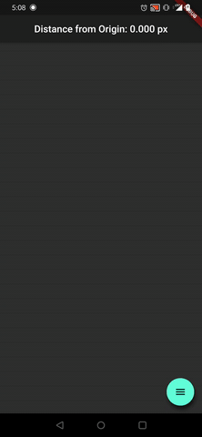

# scroller_app

CST407 - Mobile App Development in Android

Project Lead: Froenn Warner

## Overview

App that simply tracks how far you've scrolled/swiped in any direction based on your device size and displays how far you are from the origin

## Features

- Up/Down/Left/Right Swiping Gestures from User
- Distance from Origin TextView
- FloatingActionButton Drawer (Expandable)
- Reset Location to Origin FAB
- Swap Distance Units between pixels(px) -> inches(in) -> meters(m)

## Preview

